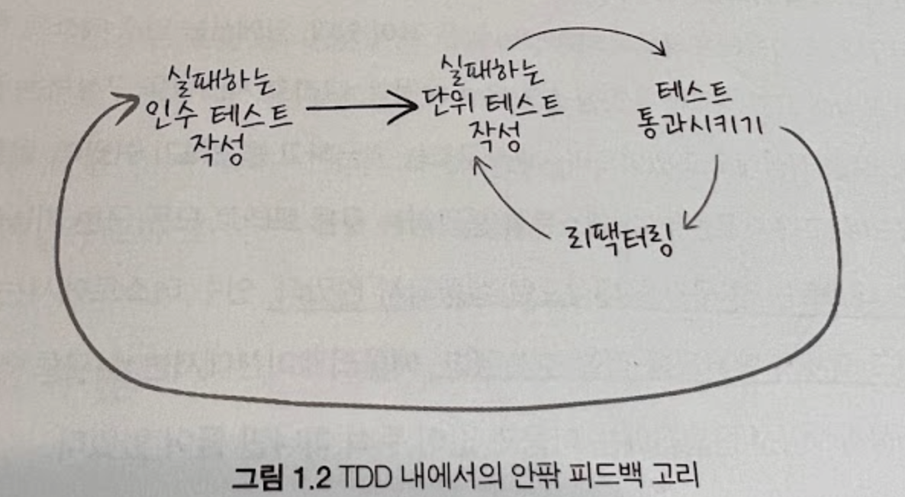
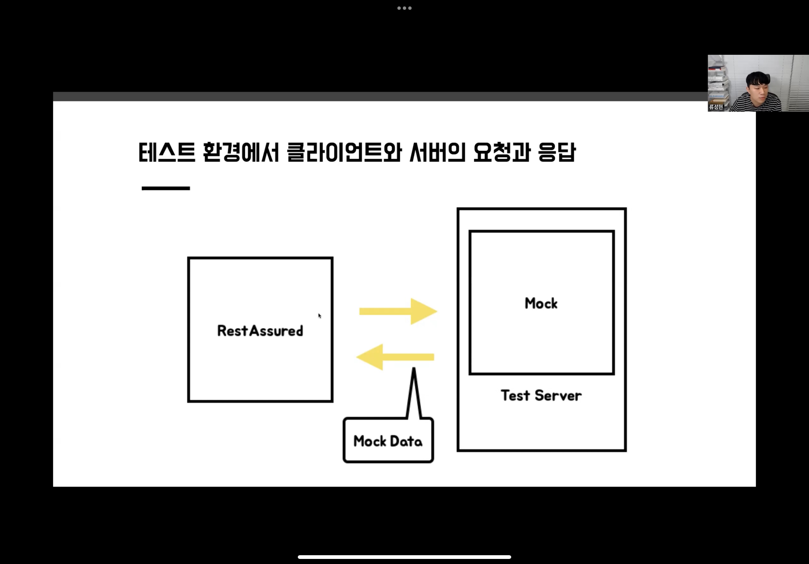

- ## What you will learn
	- What, Why, How, Pros and Cons of ATDD
	- ATDD vs UT
- ## BackGround
	- TDD사이클은 , **실패하는 인수테스트작성으로** 부터 시작한다.
	- From : **Growing Object-Oriented SW, Guided by Tests**
		- > TDD를 시작할때, 만들고자 하는 기능을 수행하는 인수 테스트를 작성하는 것으로 시작한다.
		- > 인수 테스트가 실패하는 동안은, 시스템이 아직 그 기능을 구현하고 있지 않다는 것을 알 수 있다.
		- > 인수 테스트가 통과되면,  기능 구현은 끝이다.
		- Refer : https://workflowy.com/#/09a11ac43489
- ### What is ATDD?
	- **테스트가 가능한 요구사항**으로, 소프트웨어 개발하는 프로세스
	- = **시나리오 형태의 요구사항의 테스트**를 기반으로 소프트웨어 개발하는 프로세스
	- = **인수 테스트**로 소프트웨어를 개발하는 프로세스
	- 
- #### Q: 그렇다면, AT(인수테스트)란?
	- 사용자 스토리를 검증하는 기능 테스트
	- **사용자 스토리로 테스트할 시나리오**를 지정
	- **명세나 계약의 요구 사항**이 충족되는지 확인하기 위해 수행되는 테스트로서, 보통 마지막 단계에서 수행하는 테스트를 의미한다.
	- 따라서, 인수테스트가 성공하면, 모든 작업은 끝이라고 생각 할 수 있다.
	- 즉, 작업(개발)을 종료 시켜도 되는지 검증하는 테스트이다.
	- 인수테스트의 특징 :
		- 블랙 박스 테스트의 성격을 가지고 있다.
- #### Q: 그렇다면, AT는 어느 테스트 종류에 속하는가?
	- From : 린 애자일 기법을 활용한 테스트 주도 개발
		- 인수 테스트의 개념은, 테스트 의도(목적)에 따라 정해지는 것이지, 테스트를 어떻게 구현하는지에 따라 정해지는 것이 아니다.
		- 따라서, 유닛 레벨이나 통합 레벨에서 인수테스트를 적용할 수 있다.
		- 더 나아가, 인수테스트를 유닛 또는 컴포넌트가 의도한 동작을 하는지 확인하는 설계 검증 테스트로도 사용할 수 있다.
- #### Q: 각 테스트는 무엇을 검증하는가?
	- 단위테스트: 구현한 부분, 단위를 검증
	- 통합테스트: 각 단위들이 유기적으로 잘 동작하는지 검증
	- 인수테스트: 요구사항을 만족하는지 검증
	- E2E테스트: End User의 관점 및 입력으로부터 , 해당 입력에 상호작용하는 모든 컴포넌트들의 기능을 검증
- #### Q: 그렇다면, 이번 과정에서의 인수테스트 의도(목적)은 무엇인가?
	- API 접점에서 검증하는 E2E Test.
	- API Request, Response의외의 내부 정보는 모른다고 가정한 블랙박스 테스트 형식으로 진행.
- ### Why ATDD?
	- 효율적인 개발 프로세스를 위해
		- 작업의 명확한 시작과 끝을 제시함으로써, 생산성 증가
		- 빠른 피드백으로 인해, 요구사항분석이 올바른지 빠르게 체크할 수 있다.
		- 귀찮은 작업(테스트)을 프로세스로 강제할 수 있다
- ### ATDD vs TDD
	- TDD : 작은 단위의 요구사항 단위를 테스트를 통해 구현
	- ATDD : 시나리오 형태의 요구사항 단위를 테스트를 통해 구현
- ### How to start ATDD?
	- #### Convert 요구사항 to 시나리오
	  collapsed:: true
		- 예) 콘솔 로또 게임 어플리케이션 요구사항
			- 콘솔 기반의 로또 어플리케이션을 만든다
			- 금액을 입력하면 금액에 맞는 갯수의 로또를 구입한다
			- 지난 주 당첨 번호를 입력하면 당첨 결과와 수익률이 계산된다
		- 시나리오로 변환
			- 정상적인 시나리오
				- 1000원을 입력한다
				- 10장의 로또가 구매된다
				- 구입한 10장의 로또 번호가 출력된다
				- 지난주 당첨 번호로 1,2,3,4,5,6을 입력한다
				- 당첨 통계가 출력된다
				- 수익률이 출력된다
			- 비정상 시나리오 - 적은 금액
			- 비정상 시나리오 - 유효하지 않은 당첨번호
		- 예) 지하철역 관리 API 어플리케이션 요구사항
			- 지하철 역 생성
			- 지하철 역 목록 조회
			- 지하철 역 삭제
		- 시나리오로 변환
			- 지하철 역 생성
				- 지하철 역 생성 요청을 한다
				- 지하철 역이 생성 되었다
			- 지하철 역 목록 조회
				- 지하철 역이 생성되어 있다
				- 지하철 역 목록 조회 요청을 한다
				- 지하철 역 목록이 응답되었다
				-
	- #### ATDD Tools
		- @SpringBootTest
			- 테스트에 사용할 ApplicationContext를 쉽게 지정 가능
			- 기존 @ContextConfiguration의 발전된 기능
			- SpringApplication에서 사용하는 ApplicationContext를 생성해서 작동
		- RestAssurd
- ## Assignments
  collapsed:: true
	- ### 이번 과정에서의 인수테스트 의도(목적)
		- API 접점에서 검증하는 E2E Test.
		- API Request, Response의외의 내부 정보는 모른다고 가정한 블랙박스 테스트 형식으로 진행.
	- ### 🚀 1단계 - 지하철역 인수 테스트 작성
		- 구현된 기능을 대상으로 인수 테스트를 작성
		- RestAssured를 활용하여 인수 테스트 작성
	- ### 🚀 2단계 - 지하철 노선 기능 구현
		- 제시된 인수 조건을 기반으로 기능 구현
		- 기능 구현 전에 인수 조건을 만족하는지 검증하는 인수 테스트를 먼저 만들고 기능구현
	- ### 🚀 3단계 - 구간 추가 기능 구현
		- 제시된 인수 조건을 기반으로 기능 구현
		- 기능 구현 전에 인수 조건을 만족하는지 검증하는 인수 테스트를 먼저 만들고 기능구현
	- ### 🚀 4단계 - 구간 제거 기능 구현
		- `요구사항 설명` 에서 제공되는 요구사항을 기반으로 **지하철 구간 제거 기능**을 구현
		- 요구사항을 정의한 **인수 조건**을 도출
		- 인수 조건을 검증하는 **인수 테스트**를 작성
		- 예외 케이스에 대한 검증도 포함
			-
	-
	-
- ## QnA
	- Q: What is RestAssured?
		- 
- ## Note